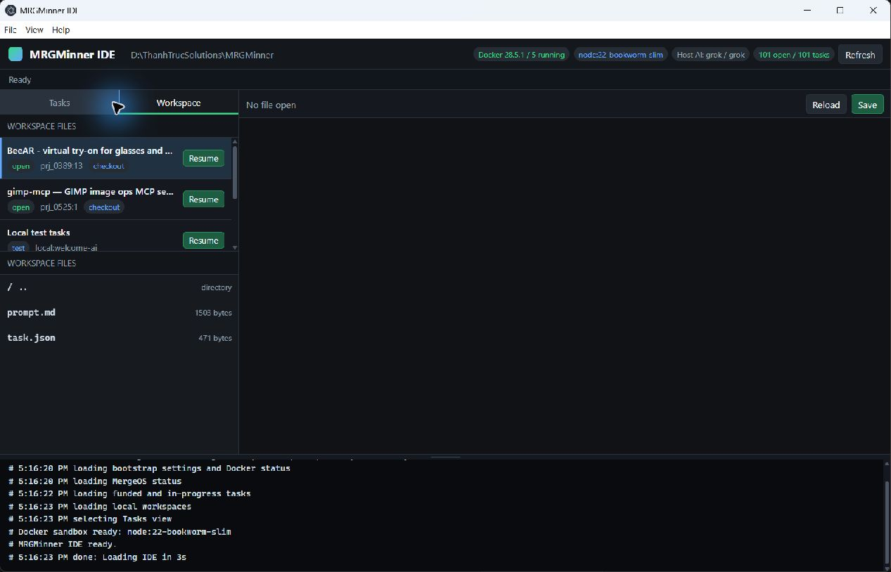

# MRGMinner

[](https://nodejs.org/)
[](package.json)
[](LICENSE)
[](https://scan.mergeos.shop)
[](https://github.com/mergeos-bounties/mergeos-contracts)
[](https://github.com/mergeos-bounties)

**MRGMinner** is the MergeOS **miner / task runner**: discover funded **MRG** work on the public marketplace and ledger, form **claim-block** clusters (job + review + audit + hash proof), **split** jobs into packs bound to the ledger tip, build **claim intents** (and optional Solana `ledgerReference`), claim/run/submit with your AI CLI — without releasing payout (accept stays with owner/admin).

**Product:** [mergeos-bounties/MRGMinner](https://github.com/mergeos-bounties/MRGMinner) · App: [mergeos.shop](https://mergeos.shop/) · Scan: [scan.mergeos.shop](https://scan.mergeos.shop/) · Contracts: [mergeos-contracts](https://github.com/mergeos-bounties/mergeos-contracts) · Funded: **`prj_0428`** · [Install guide](docs/INSTALL.md)

---

## Highlights

| Capability | Description |
| --- | --- |
| **Chain discovery** | `token` · `proof` · `verify` · `market` · `chain` · `solana` — public APIs |
| **Correct MRG rewards** | Bounty amounts parsed from titles (`[25 MRG]`) when marketplace scores pollute `reward_cents` |
| **Work split** | `split` — load-balanced packs across online job/review/audit nodes + ledger tip |
| **Claim intents** | `intent` + `claim --with-intent` — `intent_hash` / `pack_hash` / `ledger_reference` |
| **Solana anchors** | `solana` — program id, instruction map (`releasePayout`), bytes32 ledger reference |
| **Local verify** | `verify` — walk `previous_hash` links client-side |
| **IDE mode** | `mergeide ide` / `mrgminner ide` — local MergeIDE workspace for tasks, files, prompts, and guarded commands |
| **Desktop app** | Electron app wraps the local IDE into a direct Windows/Linux desktop window |
| **Docker sandbox** | IDE/Electron safe commands run through `docker run`; host AI receives Docker mount instructions for task verification |
| **Work pools + AI test** | Funded and in-progress project groups filter tasks; AI CLI presets include Codex, Claude, Grok, and custom |
| **Task runner** | `tasks` · `claim` · `run` · `submit` · `next` · `status` |
| **Safety** | Never calls task **accept** / payout release |
| **Bandwidth share** | `share start` — residential exit for [TrucVPN](https://github.com/mergeos-bounties/TrucVPN); earn **MRG** for relayed traffic |

---

## Bandwidth share → MRG (TrucVPN)

Share your connection as a **residential exit**. TrucVPN clients route SOCKS5/HTTP through your node; you accrue MRG by the gigabyte (`mrg_per_gb`, default **5**).

```powershell
# Terminal A — sharer
node .\bin\mrgminner.js share start --region vn --city "Ho Chi Minh" --port 17890
node .\bin\mrgminner.js share earnings

# Terminal B — VPN client (TrucVPN)
trucvpn configure --share-url http://127.0.0.1:17890
trucvpn connect --region vn
```

Discovery API: `GET /v1/health`, `GET /v1/exits`, `GET /v1/earnings`, `POST /v1/claim-mock`.

---

## Quick start

### Portable download (Windows)

Download `MRGMinner-Windows-x64.zip` from the [latest release](https://github.com/mergeos-bounties/MRGMinner/releases/tag/mrgminner-windows-latest), extract, and run:

```powershell
Expand-Archive -Path MRGMinner-Windows-x64.zip -DestinationPath C:\tools\mrgminner
C:\tools\mrgminner\MRGMinner-Windows-x64.exe --help
```

See [docs/INSTALL.md](docs/INSTALL.md) for detailed install steps.

### From source

```powershell
cd MRGMinner
npm ci
npm test
node .\bin\mrgminner.js --help

# Task execution in IDE/Electron requires Docker Desktop/Engine
docker version

# Local IDE (former MergeIDE workflow)
node .\bin\mergeide.js ide --workspace .
node .\bin\mrgminner.js ide --workspace . --port 17331

# Desktop app (Electron)
npm run electron -- --workspace .

# Full live smoke (public APIs, no login)
node .\bin\mrgminner.js demo

# Public chain discovery (no login)
node .\bin\mrgminner.js status
node .\bin\mrgminner.js chain
node .\bin\mrgminner.js market
node .\bin\mrgminner.js split
node .\bin\mrgminner.js verify
node .\bin\mrgminner.js solana

# Offline demos
node .\bin\mrgminner.js chain --mock
node .\bin\mrgminner.js block --mock
```

Configure + authenticate for claim/run/submit:

```powershell
node .\bin\mrgminner.js configure --mergeos-url https://mergeos.shop --provider claude --worker-id github:yourname
node .\bin\mrgminner.js login --email you@example.com --password your-password
node .\bin\mrgminner.js tasks --open
node .\bin\mrgminner.js claim <task-id> --with-intent
```

Settings: `%USERPROFILE%\.mergeide\settings.json` (`MERGEIDE_SETTINGS` / `MRGMINNER_SETTINGS`).

IDE and Electron safe commands are sandboxed by Docker. The app shows Docker engine, running container count, memory, and sandbox image in the sidebar. The AI CLI itself runs on the host machine, so install/login to Codex, Claude, Grok, or your custom CLI on Windows/Linux. The default Docker image is `node:22-bookworm-slim`; set `MRGMINNER_SANDBOX_IMAGE` or `MERGEIDE_SANDBOX_IMAGE` to change the task runtime image.

Before auto-running tasks from the IDE, choose an AI CLI preset (`codex`, `claude`, `grok`, or `custom`), adjust command/args, then press **Test**. The test checks the host AI CLI and prepares the local Welcome prompt; it does not claim, submit, or run a funded task.

The IDE also includes a local **Welcome AI runtime test** under `Local test tasks`. It asks the host AI to write `.mergeide/welcome-ai-result.json`; press **Check** to validate that the AI can edit the workspace that Docker mounts at `/workspace`.

### Desktop IDE workflow



1. Launch the desktop app with `npm run electron -- --workspace .` or run the packaged Windows/Linux app.
2. Start with **Local test tasks** and run **Welcome AI runtime test**. Funded tasks are gated until this local host-AI + Docker workspace test passes.
3. Pick a funded or in-progress work pool. The task list shows funded reward, status, and task id.
4. Press **Run task**. The AI CLI runs on the host, while Docker remains the sandbox/runtime mounted at `/workspace`; the generated prompt tells the AI about that boundary.
5. Watch the lower console. Grok/Codex/Claude stdout and stderr stream live into the console, ANSI color codes are stripped, and app log lines are forced onto clean newlines.
6. Drag the thin handle above the console to resize it. The height is saved locally.
7. Press **Stop** while a task is running to cancel the host AI process or Docker sandbox cleanly.
8. Use the **Workspace** tab to resume old or half-finished local work. The list includes root `.mergeide/tasks/*` plus checked-out project task folders under `.mergeide/projects/<project>/.mergeide/tasks/*`; press **Resume** to continue that task.
9. When a non-local task run exits `0`, MRGMinner stages code changes, excludes `.mergeide/`, creates a task branch, commits, pushes, creates a GitHub PR with `gh`, and adds a PR comment containing the task payload, changed files, diff stat, runner, prompt path, and host AI log path.

Auto PR creation requires `git`, GitHub CLI (`gh auth status` must pass), and push permission to the task repository. If push or PR creation fails, the console logs the exact failing step and leaves the local branch/commit in the project checkout.

---

## MRG blockchain discovery

Public MergeOS endpoints (readable without a worker token):

| Command | Source | What you get |
| --- | --- | --- |
| `mrgminner token` | `/api/public/token-economy` | Supply, reserves, fees, balances |
| `mrgminner proof` | `/api/public/ledger/proof` | Hash-chain root, tip, server valid/broken |
| `mrgminner verify` | proof entries (client) | Local `previous_hash` walk |
| `mrgminner market` | `/api/public/marketplace` | Funded projects + open bounties (**title MRG**) |
| `mrgminner chain` | all + agents/feed + Solana | Full discovery bundle |
| `mrgminner split` | market + claim-block + tip | Load-balanced work packs |
| `mrgminner intent [task]` | task + pack + tip + Solana | Claim intent + `ledger_reference` |
| `mrgminner solana` | proof-manifest JSON | Program id + Anchor instruction map |
| `mrgminner status` | settings + chain | Worker, provider, fleet, tip readiness |

```powershell
mrgminner token --json
mrgminner proof
mrgminner verify
mrgminner market --project prj_0428
mrgminner split
mrgminner intent prj_0428:1 --json
mrgminner chain --out discovery.json
mrgminner solana
```

Explore:

- https://scan.mergeos.shop  
- Ledger proof: https://mergeos.shop/api/public/ledger/proof  
- Solana manifest: https://mergeos.shop/contracts/solana/mergeos_mrg.proof-manifest.v1.json  

---

## Claim-block, work split & discoverable claim

```text
online job  +  online review  +  online audit  +  verified entry_hash
                         ↓
              claim-block (mrg_eligible)
                         ↓
     split → pack per bounty (pack_hash ↔ tip_hash ↔ ledger_reference)
                         ↓
     intent → claim --with-intent / submit --with-intent
                         ↓
     owner/admin accept  →  optional Solana releasePayout(ledgerReference)
```

| Role | Agents | Duty |
| --- | --- | --- |
| **job** | coding / frontend / backend | Implement + claim lane |
| **review** | review / design-review / QA | Score PR / evidence |
| **audit** | repo-scan / security | Confirm ledger hash proof |

```powershell
mrgminner nodes --online
mrgminner block
mrgminner split --json
mrgminner claim prj_0428:1 --with-intent
```

Packs **rotate** online nodes so work is not stuck on a single agent triple. Each pack carries:

- `pack_hash` — SHA-256 of task + block + tip + role assignment  
- `ledger_tip_hash` / `ledger_reference` — bytes32 anchor for Solana  
- `status` — `ready_to_claim` when block + tip + three roles are present  

---

## Claim / run / submit

```powershell
mrgminner claim <task-id> --with-intent
mrgminner run <task-id>
mrgminner submit <task-id> --pr-url https://github.com/org/repo/pull/1 --with-intent
```

`--with-intent` binds `intent_hash`, `pack_hash`, and ledger tip into agent-action evidence (discoverable on the live feed). **Payout is never released by this tool.**

---

## CLI reference

| Command | Purpose |
| --- | --- |
| `ide` / `serve` | Launch the local MergeIDE workspace UI |
| `configure` / `login` / `status` | Settings, auth, miner health |
| `tasks` / `prompt` / `run` / `claim` / `submit` / `next` | Task lifecycle |
| `nodes` / `stats` / `block` | Agent fleet + claim-block |
| `token` / `proof` / `verify` / `market` / `split` / `chain` / `intent` / `solana` | MRG chain discovery |

Common flags: `--json` · `--mock` · `--strict` · `--out <file.json>` · `--project <prj_id>` · `--with-intent`

---

## Desktop app

MRGMinner also ships as an Electron desktop app. It starts the same local MergeIDE server internally and opens it in a native desktop window, so users can run the task IDE directly without opening a terminal browser URL.

```powershell
npm run electron -- --workspace .
npm run build:electron:win      # Windows portable .exe
npm run build:electron:linux    # Linux AppImage + tar.gz
```

GitHub Actions workflow `.github/workflows/mrgminner-electron-release.yml` builds and publishes:

- `MRGMinner-<version>-windows-x64-portable.exe`
- `MRGMinner-<version>-linux-x64.AppImage`
- `MRGMinner-<version>-linux-x64.tar.gz`
- `.sha256` checksums and build metadata

Default release tag: `mrgminner-electron-latest`.

The desktop IDE uses the same runtime boundary as `mrgminner ide`: safe terminal commands execute inside a Docker container with the workspace mounted at `/workspace` and MRGMinner mounted read-only at `/opt/mrgminner`; selected task runs and auto-next start the configured AI CLI on the host and include the Docker mount details in the generated prompt.

---

## Repository layout

```text
MRGMinner/
  bin/mrgminner.js      # MRGMinner CLI entry
  bin/mergeide.js       # MergeIDE-compatible CLI entry
  src/
    api.js              # MergeOS HTTP + public chain clients
    chain.js            # token / proof / market / split / intent / Solana
    nodes.js            # fleet roles + claim-block
    cli.js              # commands
    electron-main.js    # Electron desktop app entry
    extension.js        # VS Code bridge
    ide.js              # local browser IDE server
    runner.js / prompt.js / settings.js
  test/
  docs/
```

---

## Development

```powershell
npm ci
npm test
npm run build:exe        # Windows standalone exe via pkg
npm run build:portable   # exe + sha256 + metadata → MRGMinner-Windows-x64.zip
```

Artifacts are written to `dist/`:

| File | Description |
|------|-------------|
| `MRGMinner-Windows-x64.exe` | Standalone executable |
| `MRGMinner-Windows-x64.exe.sha256` | SHA-256 checksum |
| `MRGMinner-Windows-x64.build.json` | Build metadata (commit, run ID, release URLs) |
| `MRGMinner-Windows-x64.zip` | Portable package (exe + checksum + metadata) |

Windows CI: [`.github/workflows/mrgminner-windows-exe.yml`](.github/workflows/mrgminner-windows-exe.yml)

---

## MergeOS bounties

Star → claim issue → PR to **master** → MRG **25–200**.  
See [docs/BOUNTY.md](docs/BOUNTY.md) · [mergeos](https://github.com/mergeos-bounties/mergeos).

---

## License

MIT · MergeOS / ThanhTrucSolutions

